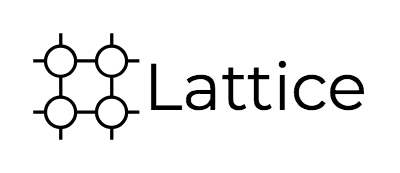

___Lattice___ is the framework for scanning pressed Brio Blobs, visiting each node of the object tree
in a depth first traversal.

It provides a full featured _schema-driven_,
_object-tree_ data modeling environment combined with
a time and space performant, binary encoding format that optimizes _depth-first_
scanning traversals. Brio data is ___pressed___
(_forward only only write_) into ___blobs___ which are _immutable_
and have identical disk and memory storage format. Brio data is ___lattice___ scanned
(_forward only read_) in an implementation that creates zero ephemeral scan
object artifacts, and are deserialized at a field granularity only as a field is accessed
during the scan. All pressing and all lattice access is done in pure linear byte order.
To a large degree, the low latency, cost effectiveness, arbitrary
complexity and scale that Burst provides is enabled by the design features of
Brio.

---
------ [HOME](../../../../../../../../../readme.md) -------------------------------------------- 
