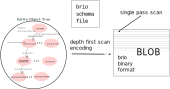

# `Brio Model`
The Brio model contains a lot of familiar modeling constructs.
However Brio was designed specifically 
to model entity _object-model_ trees that support the
Burst single pass scan model. Brio has its own binary encoding
to support this and the ability to **encode** _and_ **decode** that binary
**Blob** format efficiently.

#### `tree object model`

Entity object tree models are made up of one or more structures each made up of
some combination of state and/or relationships to other structures.
There is a single root structure and all other structures
can be reached from the root object via a transitive compound path of
relationships sequences. 
Each relationship
defines a subtree, each of which itself can recursively
contain subtree defining relationships. No cycles are allowed. 
Since this is strict containment i.e. parents contain their children
without sharing, this can also be reasonably compared to a document model as well.

#### `binary encoded depth first traversal`
Since the resulting data model is a strict tree without cycles,
it can be fully and deterministically
explored in a _depth-first-traversal_ i.e. our single-pass-scan. The matching
binary encoding structure then is  i.e. a linear scan from the beginning
of the binary encoded structure to the end will execute a depth-first-traversal
of the object-tree. This means a single-pass-scan will always be reading
data as a linear sequence of memory addresses. This is a very efficient way
to go for modern memory architectures.

#### `scan creates no objects`
The single pass scan Brio encoding format was carefully designed
so that as the encoded tree is
scanned in memory, no objects are created to access any of the encoded data
or explore any of the encoded relationships. 
This means a full scan of all state in an object tree can be
read _without creating a single object_.

## `Brio Types`
Brio has a simple type system capable of modeling a large set of real world object/relationship schema.
Its basis is a typed recursively defined object tree with a single typed root and fixed child relationships
in subtrees. Both scalar 1:1 relationships and vector 1:n relationships are handled.
Simple associative maps are also provided.

##### `Nulls`

## `Brio Primitives`
Brio provides a small set of primitive literals that match *exactly*
comparable Java or Scala JVM types. Sorry no unsigned numbers!

| Type | Description |
|---|---|
| __Boolean__ | true or false (8 bits) |
|  __Byte__ | signed 8 bit number|
| __Short__ | signed 16 bit number|
| __Int__ | signed 32 bit number|
| __Long__ | signed 64 bit number|
| __Double__ | signed floating point number|
| __String__ | UTF8 text|

Access to primitives/literals is defined as *value* based.
##### `Paths and the 'Key' schema annotation`
While scanning a tree, where you are is always defined by a _path_. Each path has a well defined _'key'_ identity. The
path can also be identified by a transitive closure of 'key' values for each instance back to the root object. This
is only possible if each of the types in that closure has a primitive field annotated by a _key_. This field must be
unique across all member of any given collection.

##### `Ordering and the 'Ordinal' schema annotation`
The Brio model supports specific ordering of collections based on the natural ordering of a specific primitive field
in the member types. The schema requires this field to be annotated with a 'ordinal' tag. This ordering is general
purpose, but presumably is used to support temporal features i.e. being sure what you see first is _'before'_ what
you see later in a scan.

## `Brio Structures`
A **structure** is a  complex object container that models a named coherent static set of relationships to
primitive types and other structures. Access to structures is defined as *reference* based.

## `Brio Relationships`
Relationships are a unidirectional navigation path from their parent structure to a *single* ( **scalar** ) or
*plural* ( **vector** ) type instance embedded in the parent structure.
There is a special form of plural relationship called a *map* ( **associative** ) that provides key to value lookups.
All relationships are of a **contains** nature, **uses** or **shared** relationships are *not* supported as all
data models are *trees* and as such are **not** graphs and **not** acyclic.

###### `Value Scalars`
Where there is a singular ( **1:1** )  relationship between the parent structure and a single primitive type, we call
that a **value scalar**.

###### `Value Vectors`
Where there is a plural ( **1:n** ) relationship between the parent structure and a single primitive type, we call
that a **value vector**. These are implemented in the data model, but unused currently in the overall burst architecture.

###### `Value Maps`
Where there is a plural ( **1:n** ) *associative* relationship between the parent structure and a single primitive type, we call
that a **value map**. A simple primitive type key maps to a simple primitive type. These are perhaps the mostly
highly optimized part of the Brio Model since that sort of
dynamic typing at high cardinality in large views is a valuable capability for real world designs.

###### `Reference Scalars`
Where there is a singular ( **1:1** )  relationship between the parent structure and a structure type, we call
that a **reference scalar**.

###### `Reference Vectors`
Where there is a plural ( **1:n** ) relationship between the parent structure and a structure typed collection,
we call that a **reference vector**.   
---
------ [HOME](../../../../../../../../../readme.md) -------------------------------------------- 
