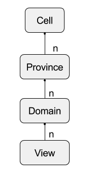

 
--

# Metadata

### Metadata Entity Identity
All entity primary keys are globally unique and represented by a 64 bit numeric key.
 All entities can be accessed by the primary key. All entities also have a _'user friendly'_
__moniker__ that is also enforced to be unique. This moniker is used for searching and general
management of meta-data entities. This simple always unique Catalog provided synthetic numeric primary key and a
user provided moniker keeps things simple to manage. 

### Implementation/Modeling Issues

* __JDBC Only__ -- The Catalog uses a simple JDBC model with no caching etc
* __Primary Key Access__ -- we access all entities by a primary key or its moniker. Both must be unique and are indexed.
* __Join Free__ -- Normal operation requires no joins between tables.
* __Immutable__ -- to as large a degree as possible, meta-data is immutable i.e. creation of new enties is preferred to
modifying existing ones.

#### Scale
The Catalog is not designed to keep track of a very large number of Cells, Provinces, Domains, and/or Views.

| Entity Type |  Scale | Notes |
|---|---|---|
| __Cells__ | 1 - 50 total | limit somewhat arbitrary |
| __Provinces__ | less than 100 per Cell | most systems start with only one per Cell |
| __Domains__ | less than 1 million |  |
| __Views__ | less than 10 per Domain |  |
| __Accounts__ | less than 100 across all Cells |  many systems would have just one headless user account|

# Metadata Model
 
 
# Cells
A Burst Cell is a physical cluster consisting of a distributed set of linux servers. There is one Burst master, possibly a
secondary master for HA scenarios, and a set of Burst workers.

# Provinces
A Burst Province is a grouping of Domains _contained_ within a Cell that is used by various types of Fabric
Stores for various issues such as movement of Domains from from Cell to Cell as well as defining limits
on certain types of queries such as cross-Domain view generation.

# Domains
A Domain is contained within a Province and represents a ___source___ of data that can have one or more contained 
Views applied to it. 

# Views
A View is contained within a single Domain and represents some sort of ___customization___ of that Domain
which can be queried. A View could for instance be essentially the Domain itself or it could be a Motif view
query/filter applied which customizes that Domain for specialized or optimized (in some way) queries.

# Accounts
Accounts are used for burst specific permissions.

---
------ [HOME](../readme.md) --------------------------------------------
