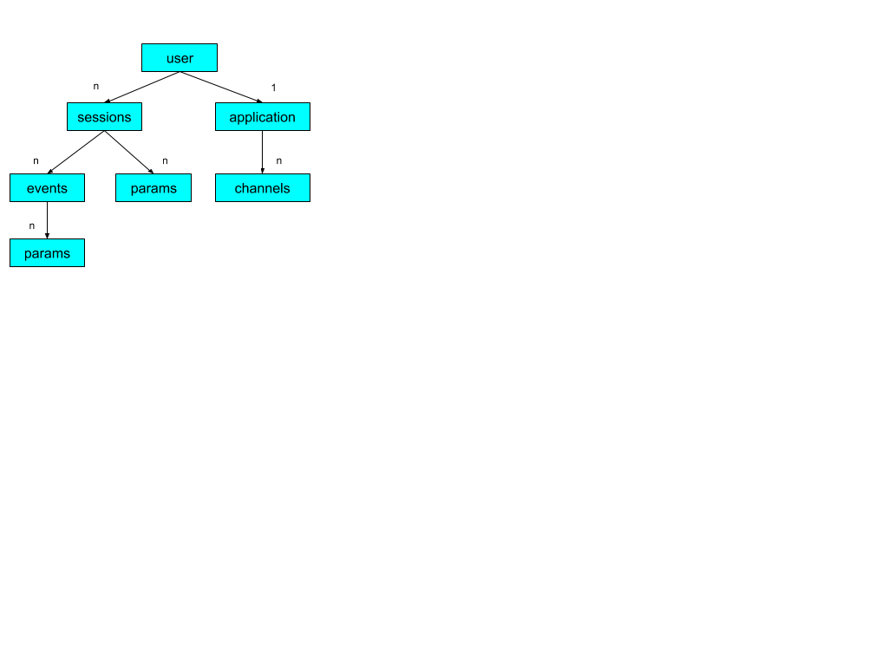
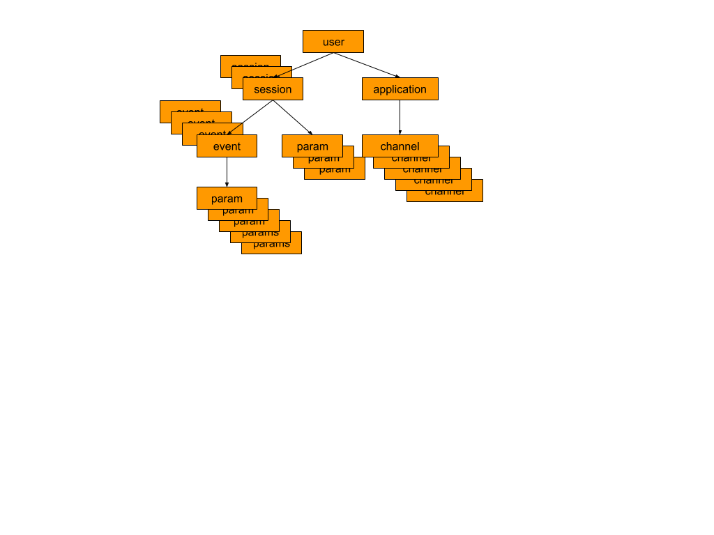
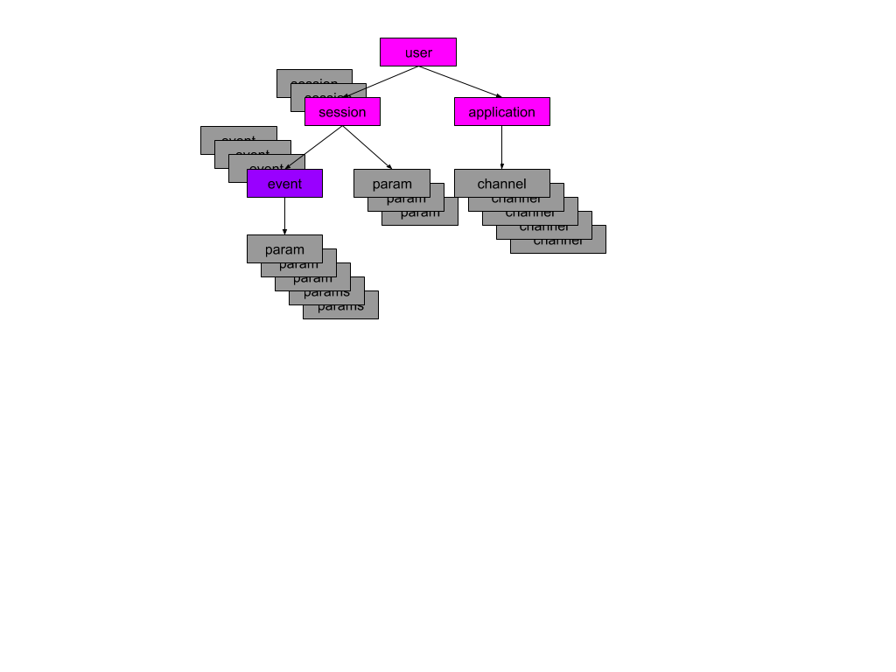

--

___EQL___ is a high level query language for exploring data in the BURST system.
It is the successor to our first generation language 'SILQ'.

### Why a New Language?

'SILQ' was our first attempt at a declarative query language over
BURSTs highly parallel scan engine.  We learned many things about how
to balance the large possibilities of what we could do with keeping the
query understandable.  If there is one thing that we would point to as
_the_ main problem with 'SILQ' it would be that the conditional syntax is
too complex and verbose for 99% of our users' queries.

### Why not SQL?

SILQ suffered from being too different from the more familiar SQL model
and EQL tries to move close to SQL so that it is familiar to users
with SQL experience.  However, the BURST query engine does not have
plans to support a full relational algebra including sorts and general joins.

The targeted sweet spot for Burst is a class of queries where relationships, the joins,
are pre-determined and queries are for statistical analysis and are orderless for the most part.
The Flurry production data is our archetype:  no individual user is examined
and no one user has any interesting comparative relationship to another.  Users
are interesting only in groups and in aggregate.

So Burst queries will not sort or do general joins.  We won't support
full SQL because we do not allow many of the queries that SQL does, but
then again we don't need to.  By supporting a SQL-like language rather
than SQL we don't have to confuse the user with explanations of what
queries they cannot write.

EQL has functionality that SQL cannot provide, the most notable being _funnels_.
A funnel allows eql to express queries finding users performing complex time ordered actions.  Such queries are
very difficult for a conventional relational language since it is akin to the parts explosion problem in computational
impact.

# Basic Concepts

## Schema

The burst system scans Brio objects.  Brio is a data driven schema system that supports objects with collections. The
basic components of Brio objects are:

1. Entity - An entity with a set of fields, references, and/or collections.
2. Scalar Field - a named scalar value.  Fields can be of the types:
	* Long
	* Int
	* Byte
	* String
	* Double
	* Boolean
3. Reference - a named reference to a scalar.  Brio only allows one reference to a scalar
4. Scalar Collection - a named set of values, all the same type
6. Map Collection - A map of key value pairs.  Currently, only String to String maps are supported.
5. Reference Collection - a named set of references to scalars

Any Brio schema is a hierarchical tree so that any entity has a _root_ entity.  A _dataset_ is a collection of
root entities.  A Eql query is translated into Hydra execution code that is used by the Burst query engine to
scan the dataset.

The schema defines the static structure of objects and the relationships between them.  The schema can be viewed
as a simple relationship tree with relationships of differing cardinality.  The collection relationships will be
the ones the compiler focuses on the most:

The Explorer system uses the *Unity* schema which consists of a _user_, containing an _application_, a collection of _sessions_,
where each session contains a collection of _events_.  The Unity schema mirrors the data representation of users in
the flurry production system.  The *Unity* schema is fully specified in a
[Brio IDL file](https://github.com/yahoo/burst/blob/main/burst-schema/src/main/resources/org/burstsys/schema/unity/unity_v1.schema)

Any part of the schema can be accessed using a _path identifier_.  For example, in the Unity schema
the path `user.sessions.events.startTime` is the path identifier to reference the start time of an event. A path
is _not_ a reference to a particular entity;  in the example `sessions` and `events` are sets of entities, so the path
is identifying the start time field in any of the sessions and events in a user entity.

Paths to map fields must supply a key value.  For example:

user.sessions.events.parameters\['BET_VALUE'\]

will access the __BET_VALUE__ parameter.

## Scanning and Visibility

The Burst query execution engine is designed for very fast, highly parallelized, scans over a large
distributed dataset.  Eql is designed to express declarative queries that can be easily converted to
these fast scans.

The scan is like a shark in that it always moves forward:  it can never go back to a place it already
visited. The engine is incrementally creating a table of rows where each row consists of a collection of elements of
aggregation or dimensions. The scan highly parallelized by the Burst query engine over the entire set of root entities, but
each individual entity is scan sequentially in a depth-first manner. As a result the Burst query engine,
and by implication, the Eql language does not support sorts or arbitrary  joins.

Given two paths identifiers, p1 and p2, they can be compared as follows:

* the _entity path_ of p1 is the path reference to the entity enclosing the path.  For example,
`user.sessions` is the entity path of `user.sessions.startTime` while the entity path of `users.sessions.events` is
itself.
* p1 is an _ancestor_ of p2 if the entity path of p1 is a
proper prefix of the entity path of p2.  For example, `user.sessions.startTime` is an ancestor of
`user.sessions.events.id`.
* p1 is a _descendant_ of p2 if p2 is an ancestor of p1.
* p1 is _off-axis_ of p2 if p2 and 1 are not the same and not ancestors
* p1 is _lower_ than p2 if p2 is an ancestor of p1.

At any point in a scan of the root entities in a dataset, the query engine has a restricted view:

* The engine can see only one entity at a time
* At any point in the depth first traversal, the query engine visits each of the entity paths in the root
entity.
* At any point in the depth first traversal of the entity, the query engine can only access paths that
have the same entity path or are ancestors of the current visit path.
* Any scalar fields or scalar references from the current visit's ancestors are accessible.

The visibility restrictions imposed by the query engine, implies that one important job for the EQL compiler is to ensure
that any data, calculation or restriction requested in the query can be evaluated with in these restrictions. The most
important consequence is that, except under special conditions,  EQL must prevent expressions that need data from two different
locations in an entity that are off-axis from each other.  Fortunately, this hasn't been needed for our EQL use cases so far.

In the previous diagram, the execution is visiting one event instance in `usr.sessions.evewnts` collection relationship.
All the colored entities are visible to the visit as well as all scalar fields in those entities.  The scalar
relationship `user.application` is also visible, but not the entities in the collection `user.application.channels`

## Pre-computed Joins

The scan only nature of Burst doesn't mean that it doesn't support any joins, it just doesn't allow ad-hoc joins.  Analogous to a
Relational DBMS "database" having a schema of SQL tables and foreign keys between these tables,  the BRIO schema
defines a set of objects with relationships between these objects.
The collection fields in the Brio schema define fields containing zero or more objects and are relationships between objects.
They are join relationships that have been pre-determined by the schema definition.

Perhaps another way of driving this point home, is to imagine representing the Unity schema as a fully normalized, relational schema.
In such a representation,  a relation DBMS would need three separate user, session and event tables to hold
instances of these objects.  In order to find all the values for a path such as `user.sessions.events.startTime`, one would
first need join the users, sessions and event tables.  In Unity, the
reference collections, `events` and `sessions`, are the predetermined representations of these joins.

#Syntax and Semantics

## Overview
The best introduction to the EQL syntax is to look at a simple representative example and identify the key
components of the query:

		select count(user.sessions) as "sessions",
			day(user.sessions.startTime) as "day"
		from schema unity
		where user.sessions.startTime > NOW - DAYS(90)
		limit 50

- `select`, the select keyword marks the beginning of the query.
- `count(...), day(...)`, the target section defines the result fields returned by the query.  There are two
types of targets:
	- _aggregate_ targets, like `count(user.sessions)`, where the values of multiple rows are grouped together to form a
	single more significant measurement.  Aggregate targets are always _aggregate function_ expressions.
	- _dimension_ targets, like `day(user.sessions.startTime)`, which bucket aggregate targets into separate values for
	each unique value for the dimension; they are similar
	to `groupBy` in SQL.  Dimension targets can be simple path references to data or may formed into new buckets using _slice functions_.
	Any expression in a target that is not an aggregate is a dimension.
- `where user.sessions.startTime > NOW - DAYS(1)`, the predicate clause restricting the data contributing to target data.
- `from schema unity`, the from clause minimally identifies the data schema the query is over, but it can also bring other
Motif structures, such as funnels and segments, into the query.
- `limit 50`, is optional and is the maximum number of rows the query is allowed to return.  If query returns more than this number
then the result will be truncated to this number.

EQL was developed for a multi-tenant system using common schemas
that are pre-compiled and cached for speed, so the query is associated with a specific dataset at execution not at definition.
The query declaration just needs the schema definition to check path validity and type consistency.  During execution, the schema used in
in the query is validated against the schema of the target dataset.   For many of the examples that follow,  we will leave
off the `from schema unity` part of the query for brevity.

## Basic Expression Syntax

Most constructs in Eql are formed from one or more expressions or predicates.  Predicates
are just expressions that result in a boolean.

### Types
The most basic part of an expression is either a _literal_ or a _path reference_.  Each of these can have a _type_.
Currently, EQL supports the following types:

- Boolean
- Byte
- Short
- Int
- Long
- Short
- String
- DateTime

Most types supported in Brio are represented here except for the addition of the `DateTime` type.  The date time type
is really a pseudo-type that is always stored as a Long in a Brio object.

A _path reference_ is just a reference to some part of the schema entity that will be scanned.  A literal is a constant
value:

- Boolean literals are `true` or `false`
- Byte literals are the values 0 to 255 followed by `B`:  for example, `23B`
- Integer is a sequence of numbers 0 to 9, limited by the integer ranges: for example, `23194320`
- Long is a sequence of numbers 0 to 9 followed by `L`: for example, `2340506L`
- Double is a sequence of numbers 0-9, an optional `.`, the decimal sequence of numbers 0-9 and an optional final `D`:
for example `12.45D`
- String is quote delimited: for example, `'A string'`.  Strings can have special escape in them:  `\'`, `\n`, '\t`, '\r`.
Strings can contain any UTF-8 characters.

Currently, there is implicit type conversion in EQL, so compatible types will be converted.  However, there
are times when explicit casting is necessary. EQL allows type casting from some types to others, using the `CAST` operator:
for example, `cast(user.sessions.startTime as datetime)`

### Precedence

Expressions in Eql have traditional operator precedence that can be overridden by using parentheses

### Arithmetic

EQL supports basic arithmetic operations on the numeric types:

- `*` multiply
- `/` division
- `+` addition
- `-` subtraction
- `%` modulo

### Comparison

EQL supports comparison operations on types:

- `==` equality
- `<>` or `!=` inequality
- `>` greater than
- `<` less than
= `>=` greater than or equal
- `<=` less than or equal
- `is null` null test
- `is not null` negative null test
- `in (val, val,...)` inclusive membership test
- `not in (val, val,...)` exclusive membership test
- `between val and val` inclusive range test
- `not between val and val` exclusive range test

Comparison operators always produce a boolean value.  Expressions that result in a boolean are _predicate expressions_

### Logical Operators

EQL supports logical operations on predicate expressions:

- `&&` conjunction
- `||` disjunction
- `NOT` negation

## Dimensions
As presented above, a target dimension consists of an _dimension function_ with an expression argument.
Dimension functions can also appear as subordinate expressions in a more complex expression.

###Dimensioning Functions
EQL provides the following bucketing functions.

#### Calendar Components
These slicing functions extract a component of a date time.  The timezone used is determined by the timezone
specified or implied in the `over` clause of the Silq query.

* `secondofminute` - the seconds component
* `minuteofhour` - the minutes component
* `hourofday` - the hour component
* `dayofweek` - the day of week component
* `dayofmonth` - the day of the month component
* `weekofyear` - the week in the year component
* `monthofyear` - the month of year component
* `theyear` - the year component

#### Calendar Rounding
These slicing functions round a date time to a boundary for bucketing.  The definition of when midnight is, is
defined by the timezone of the query.

* `year` - round to midnight, Jan 1 of the year
* `half` - round to midnight, of first day of the half year
* `quater` - round to midnight, of the first day of the current quarter
* `month` - round to midnight, first of the month
* `week` - round to midnight of the first day of the week
* `day` - round to midnight of this day
* `hour` - round to hour of this day
* `minute` - round to nearest minute
* `second` - round to nearest second

#### Millis Rounding
Take a time duration in millisecond and return the number of some other granularity

* `weekduration` - number of weeks elapsed in duration
* `dayduration` - number of days elapsed in duration
* `hourduration` -  number of hours elapsed in duration
* `minuteduration` - number of minutes elapsed in duration
* `secondduration` - number of seconds elapsed in duration

#### Calendar Slices to Millis
Take a number of some granularity and return the duration in milliseconds.  Basically this is the inverse of
the previous group of functions

* `weeks` - number of weeks to millis
* `days` - number of days to millis
* `hours` - number of hours to millis
* `minutes` - number of minutes to millis
* `seconds` - number of seconds

## Aggregations

As presented above, a target aggregation consists of an _aggregation function_ with an expression argument.  Similar
to dimension functions, aggregations can also appear as subordinate expressions in a more complex expression.

### Aggregation Functions
EQL supplies the following aggregation functions.  All but the last two are valid in sub-expressions:

* `count(<reference colleciton path>)` - count the number of occurrences of items in a collection
* `sum(<scalar numeric>)` - sum values
* `min(<scalar numeric>)` - select min value
* `max(<scalar numeric>)` - select max value
* `top[<literal>](<scalar>)` - find the approximate top k values.  This aggregation can only appear as a target.
* `uniques(<scalar>)` - unique entities: return a 1 if invoked any number of times during a traversal of an entity,
and then sum across all entities.  This aggregation can only appear as target.

## Expression Evaluation

### A Quick Engine Review

In order to understand some constraints on expressions in EQL, a quick review of the Burst execution engine is
helpful.
For every root data instance, the burst query engine does a depth-first-search over the tree of references and collections, visiting
each sub-instance if needed.  Each visit corresponds to one of the reference or collections _paths_ in the data schema.
For example, in the Unity schema, the engine visits `user.sessions.events` for every event instance
in every session in the user. The engine visits reference collections (the previous example), scalar collections,
reference scalars, and map collections. Scalar fields, `user.sessions.id` are not visited.

During the visit, the engine has only a limited view of the entire instance. It can access:

1. any scalar fields of a reference path visit
2. all parent instances, and their scalar fields
3. any scalar reference (and contained scalar fields) of any parent instance.

### Evaluation Path

Given this understanding of engine's visibility restrictions, we can discuss the _natural evaluation path_ of the expression.
The evaluation path is the first visit path the expression can be calculated by the engine.  For any expression it is
determined recursively:

1. constants can be evaluated at the root
2. scalar fields are evaluated at the path of the parent container.
3. dimension functions are evaluated at the evaluation path of the target expression.
4. aggregation functions are evaluated at the parent path of the target expression's evaluation path---if there
is no context which we will discuss later.
5. For all operations evaluate at the longest path of all the arguments.  All arguments must be on-axis with each
other--with one exception which we will discuss later.

The evaluation path corresponds the visit path where the query engine calculates an expression and is during query
planning.   An expression is `visibibly consistent` when no portion of an expression is off-axis with another portion.
An expression that isn't consistent will have no visit location
where it is possible evaluated iit within the visibility restrictions of the query engine.

For example,

	`user.sessions.events.startTime < user.sessions.startTime + seconds(20)`

has a the evaluation path `user.sesssions.events` and can be tested at that visit since the start times for the event and
it's parent session is visible.

On the other hand,

	`user.sessions.events.parameters['CHANNEL'] == user.application.channels.id`

Doesn't have a valid evaluation path, because there is no visit where event data and channel data are visible together.

## Where Predicate Enforcement

### Consistency
There `where` predicate expression in an EQL query constrains the data used in target aggregations and dimensions.  The
expression comprised of a zero or more sub-predicates conjuncted together using `&&`.  This is the one exception
where the overall expression does not have to be visibly consistent, but only at the top conjunctions.   Disjunctions, `||`, do not
allow this exception and must be consistent. So while

	user.sessions.id < 20  && user.events.id < 30 && user.application.channels.id < 2

is allowed, the following

	(user.sessions.id < 20  && user.events.id < 30) || user.application.channels.id < 2

is not.

### Data Control

Each component predicate in the `where` clause is consistent and has an evaluation path where it can be tested.  This test
controls the inclusion of data into the query's target aggregates or dimensions calculated in any descendents.

For example in the following query,

	select sum(user.sessions.events.duration) where user.sessions.startTime < now - days(30)

only data from events contained in a session started in the last thirty days should be summed.  At each visit of
an instance of node `user.sessions` the predicate is evaluated and when it is false, the lower data can be skipped or
_short circuited_.  This predicate can be evaluated upon entry to the visit and is a _pre-condition_ predicate.

Other predicates can only be tested upon the completion of the visit for an instance including all the children.  The
following query has a _post-condition_ query due to the use of an aggregate in the predicate,

	select sum(user.sessions.events.duration) where count(user.sessions.events) > 100

The count of sessions is calculated before the predicate is evaluated at the end of the visit.  Whenever the predicate fails,
the child event duration values are not added to the target sum.

### Null Control

In addition to controlling data inclusion for descendants of the evaluation path, each component predicate also controls
the inclusion of data gathered ancestors of the evaluation path.   The predicate enforces an existence test on
any ancestor instances of the evaluation path.

In the simplest case, this query only wants user with at least one example of the target event:

	select count(user) where user.sessions.events.id == 1

The requirement of the existence of at least one data child instance satisfying the predicate extends all the way up
the chain of ancestor instances to the root object.  For example,

	select count(user), month(user.sessions.startTime) where user.sessions.events.id == 1

will only count users with at least one of the desired events and only dimension it by months of sessions having at
least one event too.

This existence requirement eliminates undesired nulls by making the schema references behave as inner join relationships.
In the previous example, if we didn't enforce existence then the user would see among the results a result like
`(1000,  null)` or the count of all users that did not have any session with the desired event.

In the future, EQL may be extended to temporarily treat certain relationships as outer joins.

## Aggregates in Sub-expressions
Target aggregates are computed for a specific data instance and then aggregated together across all instances
into a result, but aggregates can also appear in expressions producing values that are used in further calculations,
in comparisons or even as dimensions.  All aggregation functions are allowed except for `top` and `unique`; they
are only allowed in targets because they only make sense when aggregated across multiple user and not in context of
a single user.

Aggregates in expressions are often used in predicates to constrain data on the totality of a collection field.
For example, counting all users that have opened a lot of sessions:

	select count(user) where count(user.sessions) > 1000

An aggregate expressions can have its own restriction on the data it operates on and these restrictions
can in turn use aggregates.  For example, count users with a lot of heavy activity sessions:

	select count(user) where (count(user.sessions) where count(users.sessions.events) > 1000) > 20

An aggregate with a predicate must be surrounded with parenthesis in order to clearly define the boundaries
of the expression.  This becomes very important when you have nested aggregates that have predicates.
This example counts users that have a lot of sessions with heavy use of a specific event:

	select count(user) where (count(user.sessions) where
								(count(user.sessions.events) where user.sessions.events.id == 3)
							> 20) > 10

The previous examples illustrate how an aggregate expression has a _natural result path_ where the
resulting value will be available based on the context in which it is used. This may be the same as the
evaluation path, and ancestor path, but never a descendant.  The value for `count(user.sessions)` is
used to constrain a user, so the result is the count of sessions for the user.   The value for `count(user.sessions.events)`
is used to constrain the `user.sessions` count, so the result is the count of events for that session.  A slightly
different example show the case where the `count(user.sessions.events)` is the count of all events for the user because
it is directly constraining the `user` in the target count:

	select count(user) where (count(users.sessions.events) where user.sessions.events.id == 3) > 20

Sometimes, the natural result path is not what we want and there is a mechanism for declaring the result _scope_ using the
`scope` syntax.  For example, the natural result for the following query,

	select count(user.sessions) as `session count`, hourofday(user.sessions.startTime) where
		(count(user.sessions.events) where user.sessions.events.id == 1) > 100

would be at `user.sessions` and so only sessions with over one hundred occurrences of the desired event would be
counted by start time.  But if we _really_ want all the sessions for users that experienced the desired event one hundered
times over there entire history then we need to explicitly declare the scope of the aggregate:

	select count(user.sessions) as `session count`, hourofday(user.sessions.startTime) where
		(count(user.sessions.events) scope user where user.sessions.events.id == 1) > 100o

If aggregate expression, i.e. one with a `scope` or a `where` clause, appears in the query target, it will be interpreted
as a dimension.  So the following query,

	select count(user) as 'users', (count(user.sessions.events) where user.sessions.events.id == 1) as 'event count'
		where user.sessions.startTime < now - days(30)

will return several rows containing the count of user with 0, 1, 2, 3, etc. occurrences of the desired event in the
last 30 days.  These counts are dimensions and are *not* aggregated across all users;  they defined buckets that the
`users` count will be aggregated across users.

## Limit
The limit clause is optional and is the maximum number of rows the query is allowed to return.  If query returns more than this number
then it is an error.  The default is 500 rows.

It might be tempting for the user to set this value to some very high number in order to avoid query failures due
to too many rows.  However,  setting
the value too high impacts the speed and capacity of the system.

The number of rows returned by a query is directly related to the number of dimensions and the cardinality of their ranges.
One can use this to estimate the number of rows.  For example, if a query has one dimension consisting of a date
with a `dayofweek` function then the maximum number of rows will be 7.  Each additional dimension multiplies the possible
number of results by the cardinality.  Queries with only aggregate targets return one row. Adding a `monthofyear`
and`dayofweek` dimension, multiplies possible results by `12 x 7 = 84`.

## Parallel Queries

The "always forward", highly concurrent nature of the query engine means the scan of a set of data entities is always
the same and only result table and visit logic differs between two queries. Eql supports simultaneous queries over
the same data scan using the `beside` operator.  For example,

		select count(user) as userCount, count(user.sessions) as sessionCount,
			count(user.sessions.events) as eventCount
		beside select count(user) as users, user.deviceModelId as deviceModel
					where user.deficeModelId between 1 and 100
		beside select count(user.sessions) as sessionParameterFrequency, user.sessions.parameters.key as sessionParameterKey
		from schema unity

will return 3 independent _result sets_ from this single query.  Each query has independent aggregation and dimension
targets as well as independent `where` clauses.  However, they share the same `from` target schema since they
are over the same dataset.

The parallel queries can have an optional _global_ where clause with a predicate that applies to all the
queries:

		select count(user) as userCount, count(user.sessions) as sessionCount,
			count(user.sessions.events) as eventCount
		beside select count(user) as users, user.deviceModelId as deviceModel
					where user.deficeModelId between 1 and 100
		beside select count(user.sessions) as sessionParameterFrequency, user.sessions.parameters.key as sessionParameterKey
		from schema unity
		where user.sessions.startTime > NOW - DAYS(30)

The global where clause is just syntactic sugar to repeating a conjunction of that predicate in each individual query's
where clause.

## Parameterized Queries

Many times a single query is used over and over again with only minor variation;  for example, counting the numbers
of particular event where only the event id differs from one query to the next.  The Burst query engine compiles every
query and caches it in case it can reuse it.  This makes repeated queries very fast, but would be less so if the
subsequent queries differ by some simple test value.

EQL support parameterized queries to help solve this:

		select(event: string) count(user.sessions.events) from schema unity
			where user.sessions.events.id == $event

This query takes a string argument which will determine the event id the query will  filter for.  The same precompiled
query is used for each invocation even when the parameter differs.

Parallel queries with `beside` clauses can be parameterized too:

		select(event: string, session: int) count(user.sessions.events) from schema unity
			where user.sessions.events.id == $event beside
		select  count(user.sessions) where user.sessions.id == $session

The signature must be on the first select clause, but the parameters are
available to each individual query.

Parameters can be scalars or vectors of any valid EQL data type.  A vector allows a set of values to be passed and
is primarily used for testing a set of values:

		select(events: vector[string]) count(user.sessions.events)
			where user.sessions.events.id in $events

## Funnels

### Overview

A _funnel_ is an tool allowing an analyst to find users exhibiting interesting behaviors. Behaviors are causally
ordered and can be time restricted:  "a user first installs the application, then completes 5 levels within 2 days."
EQL funnels generalize this analysis by defining what constitutes an _interesting_ event and defining a pattern
for finding matching event subsequences in a continuous series of recognized events in the data.

A funnel is a set of _steps_ and a regular expresion _definition_.  Each step is defined by a numeric identifier, a _when_
predicate determining when the step can trigger, and an optional time window the step
triggering must fall within.  A funnel is analogous to regular expression matcher in an editor:  the steps are the characters, and the definition
describes the substrings to match in the larger document.

The funnel definition is implemented by deterministic finite automata (DFA) that tests for transitions when steps trigger.
When the query engine begins the scan of a root entity, a DFA state is initialized. As the engine does the depth
first traversal of the root entity and all its sub entities, the steps of a funnel are tested.  When the DFA transitions to a new
state it records the occurrence of the step along with a time, obtained from the data that triggered the step, into a log.
As steps are recorded they are added to the _current path_ containing the sequence of steps contributing to a _partial match_
of the regular expression.  If the DFA completes the regular expression, then the current path is ended and marked as _completed_.
On the other hand, if the DFA fails, i.e. an event is triggered prevents the partial sequence from ever matching, the path is
ended and marked as _partial_.  In both cases, the DFA is restarted and a new path created.
At the end
of traversal of the entity, the log is presented as collection of _path_ entities, each having a collection of _step_ entities.
Each step entity has `step id` and a `time`, it was created.
After the entity is scanned, the path collection can be queried.

There are two types of funnels:

- _Once_ funnels where each once there is one complete path, the funnel will stop recording
- _Repeat_ funnels where multiple complete paths are allowed.

The difference between them is how many complete paths are recognized.  The once funnel is the "find first match" while
the repeat is the "find all".  Both types record partial matches leading up to a complete path in the form of partial paths.
Partial paths can be useful in analysis to identify when in series of behaviors a potential match fails.

### Declaring a Funnel

Let's look at a very simple example funnel with three steps

	funnel 'interesting event' repeat {
		step 1 when user.sessions.events.eventId == 6378213
		step 2 when user.sessions.events.eventId == 4498117
		step 99 when start of user.sessions
		1 : 2 : 2
	} from schema unity

This funnel is trying to find times when a user does event 6378213 followed by two occurrences of event 4498117 within
the same session. Breaking down the declaration we see:

- `funnel 'interesting event' repeat {` - this declares the funnel name and that it is a repeating
funnel.  A repeating funnel will detect all occurrences of this sequence by the suer.
- `} on schema unity` - this tells us that the funnel is against the unity schema.  All paths used are validated against
unity.
- `step 1 when user.sessions.events.eventId == 6378213` - the steps are numbered and have two parts:
	- a `when` clause specifying a predicate that triggers the step;  in this case the event entity with id `6378213`
	is scanned.
- `step 2 when user.sessions.events.eventId == 4498117` - steps are declared
	in any order, but must be uniquely identified with number.  The numbers do not need to be sequential.
- `step 99 when start of user.sessions` - This step triggers when a new session is scanned.  This step isn't mentioned in
the definition, so when it triggers it will fail any in progress match.  This effectively ensures that any complete path
must be in the same session.
- `1 : 2 : 2` - this declares the desired order of steps the funnel will match.  This example matches an occurrence of step
`1` followed by two occurrences of step `2`.  The regular expression syntax
for funnels definitions is standard RE syntax with the addition of the `:` operator to specify
sequential steps; in string regular expressions `a` followed by `b` is expressed as `ab`, but here it
is `a:b`

The next example uses a lot of more advanced features of a funnel:

	funnel 'interesting event' conversion limit 10000 {
		step 1 when user.sessions.events.eventId == 6378213
		step 2 when user.sessions.events.eventId == 4498117
		step 3 when user.sessions.events.eventId == 4495000
		step 5 when user.sessions.events.eventId == 5000000
			timing on user.sessions.events.startTime + hours(1)
			after seconds(1) within minutes(1)
		(1|3) : [^2] : 2 : [^3] : 3 : [^5] : 5
	} from schema unity

Like the previous example, most steps are triggered when certain events are scanned for the user however there
is no step `99` which recognizes the start of a new session.  The definition is a more complex regular expression.
The interesting differences are:

- `1 : (?:[^2]) : 2 : (?:[^3]) : 3 : (?:[^5]) : 5` - In real life conversion funnels, one doesn't care if some event
repeats before or after the position we placed it in the desired conversion match definition.
This definition matches the sequence `1`, `2`, `3`, `5`, but is using the non capturing group operator, `(?: )`, and
the negating bracket operator, `[^2]`, to ignore events other than the one it is watching for.  So the fragment `2 : (?: [^3]*) : 3`
will match `2` but ignore and not record any events until it matches `3`.
-  `timing on user.sessions.events.startTime` -  the `timing` phrase overrides the default timing for
a step and explicitly specifies that the time for the step will be recorded as the standard event time
sifted by one hour.  If no timing expression is present, EQL will examine the Brio schema and use the
`ordinal` field for the scanned object.  In Unity schema, `user.sessions.events.startTime` is the ordinal
field for the event object.
- `after seconds(1) within minutes(1)` - this constrains the triggering of step `5` to more than a second, but
less than 1 minute of the previous step. Both `after` and `within` or independently optional.  If one of them
is not specified then that end of the trigger window is unbounded.
- `limit 10000` - this caps the number of funnel recordings to 10000 steps preventing the funnel log from
growing too large.

### Using a Funnel in a Query
A funnel defines a graph of causal event paths.  The graph is tracked by a finite state machine (FSM) that watches for
step transition conditions as each root entity in a dataset is scanned.
After finishing an entity, the funnel has a journal of event records consisting of the step id, and the time.
This collection is then scanned just like the root entity was, searching for event records matching the where predicate.

The funnel journal consists of a collection of paths and each path has a sequence of steps making up that path.

Each path entity in the journal consists of the following fields:

- `startTime` the time the path started or, in other words, the time of the first step.
- `endTime` the time the path finished or, in other words, the time of the last step.
- `isComplete` a boolean indicating if the path truly completed or was abandoned due to either an abort or time condition
- `isFirst` a boolean indicating if the path is the first path recorded
- `isLast` a boolean indicating if the path is the last path recorded
- `ordinal` the ordinal in the log for this

Each step entity in the path `steps` collection has two fields:

- `id` the step number
- `time` the recorded time of the step
- `isComplete` a boolean indicating if the step is a member of a completed path
- `isFirst` a boolean indicating if the step is the first in it's path
- `isLast` a boolean indicating if the step is the last in it's path
- `ordinal` the ordinal in this path for the step

The funnel journal objects are queried in EQL just as dataset objects.  For example, to access the path start time use
`f.paths.startTime`.  To access the step id use `f.paths.steps.id`.

The following is an example query over the following repeating funnel:

		funnel 'lots of events' repeat {
		step 1 when start of user.sessions
		step 2 when user.sessions.events.eventId == 4498117
		step 3 when user.sessions.events.eventId == 4495000
		step 4 when user.sessions.events.eventId == 4495001
		step 5 when user.sessions.events.eventId == 5000000
		step 6 when user.sessions.events.eventId == 5000001
		1 : 2 : 3 : 4 : 5 : 6
		} from schema unity

We can query this funnel asking how many incomplete funnels had more than 4 steps:

		select count(f.paths)
		from schema Unity, funnel 'interesting events' as f
		where length(f.path.steps) > 4 && !f.path.isComplete

This query counts the number of paths that took longer than one day to complete:

		select count(f.paths) as 'paths'
		from schema Unity, funnel 'interesting event' as f
		where f.paths.isComplete && f.paths.endTime - f.paths.startTime >= DAYS(1)

### Parameterizing Funnels

Just as a basic EQL query can be parameterized, a funnel can be parameterized.  Let's parameterize a previous example
funnel:

	funnel 'interesting event'(one: long, two: long) repeat {
		step 1 when user.sessions.events.eventId == $one
		step 2 when user.sessions.events.eventId == $two
		step 99 when start of user.sessions
		1 : 2 : 2
	} from schema unity

Funnels are used within select queries, and the values of the funnel parameters are set
as arguments to the funnel reference in the `from` clause:

	select count(f.paths.step), f.paths.step.id
		from funnel 'interesting event'(6378213, 4498117) as f, schema Unity
		where f.paths.isComplete

Since select queries can be parameterized themselves, we can pass select parameters through
to the funnel as so:

	select(o: long)  count(f.paths.step), f.paths.step.id
		from funnel 'interesting event'($o, 4498117) as f, schema Unity
		where f.paths.isComplete

### Multiple Funnels: Calculating Fixed User Retention
Multiple funnels are allowed in a query, but only one of them can be a repeat funnel. A good example of a useful
query over multiple funnels is _user retention_. In fixed user retention, the time that a user triggers a _cohort_
event, puts the user into a day bucket and every time the user triggers one or more  _measurement_ event is counted and grouped
into a day some relative offset from the cohort day.

For example,  for 30 day retention, there would be a count of times the user did the measurement event on day zero,
day one, on up to day 30.  It can even be possible that the measurement occurs in the past from the cohort event
implying that the counts can be bucketed into negative day offsets.

We use two funnels to calculate user retention:

* A _once_ funnel to calculate the cohort event time for the user.  A once funnel means that the funnel
history has at most one path.  The time of the last step in that path is the cohort time for the user.
* A _repeat_ funnel to calculate paths of measurement event times for the user. The funnel history contains a path
for each measurement event triggered by the user and end time of the path is the measurement time.

Using the two funnels the following query will give us user retention:

	funnel 'cohort' once {
	step 1 start of user
	1
	} from schema unity

	funnel 'measurement' repeat {
	step 1 when start of user.session
	step 2 when user.sessions.events.eventId == 4498117
	step 3 when user.sessions.events.eventId == 4495000
	step 5 when user.sessions.events.eventId == 5000000
	step 99 when start of user.sessions
	1 : (2 | 3) : 5
	} from schema unity

	select unique(mf.paths) as 'users',
		count(mf.paths) as 'times',
		day(cf.paths.endTime) as cohort,
		day(mf.paths.endTime) - day(cf.paths.endTime) as measure
	from funnel 'cohort' as 'cf', funnel 'measurement' as mf, schema unity, schema Unity
	where day(mf.paths.endTime) - day(cf.paths.endTime) between days(-31) and days(31) and
		cf.paths.isComplete

The `cf` funnel records the cohort event, while the `tf` funnel records paths of measurement events.

### Funnel Step Data Recording _Speculative Functionality_

Adding variable declarations to a funnel, allows a step to add additional information to a triggered step recording.
The field is valid for any step and is assigned data during triggering using the `recording` clause.  Later, this field
may be used when querying the funnel.

As an example, let's look at the following funnel query:

	funnel 'interesting event' repeat limit 10000 {
		var eventId: long
		step 1 recording eventId=user.sessions.events.eventId
			when user.sessions.events.eventId in (6378213, 4498117, 6378213, 5000000)
		step 99 when start of user.sessions
		99 : 1+
	} from schema unity
	select count(f.paths.steps), f.paths.steps.eventId
		from funnel 'interesting events' as f, schema Unity
		where f.paths.isComplete && f.paths.step.id == 1

The query, can analyze the number of times each of the different four events for step 1, is present in a complete path.

## Special Functions

In developing Burst for query analytics there are a couple specialized functions that help us calculate useful
analytics.

### Frequency Calculations
EQL has a specialized frequency function designed to help calculate the frequency of items in a collection based
on a grouping of the collections key.  It's main purpose at the moment is to help calculate session frequency in
our schema:  how many users had 3 sessions on some day? Notice it acts like a counting aggregator within an entity, but
results in a fixed dimension for global results.

For example, the following query uses `frequency` to calculate the number of users grouped into the number of
sessions they did in each day of the last 30 days.

	select count(user) as 'users',
		frequency(user.sessions, day(user.sessions.startTime)) as 'sessions'
	from schema unity
	where day(now) - day(user.sessions.startTime) < 30

The `frequency` function is unusual since it is dimensioning function that takes two arguments and creates two columns.
First let's discuss the arguments:

1. the first argument is a path to a collection field and the function will count each instance in that collection.
2. the second argument is a tracking expressions that controls how the count is dimensioned.

In the above example, as the `user.sessions` collection is scan, the function adds to the count of instances as long as the
expression `day(user.sessions.startTime)` has the same value.  When the value changes,  the function records the current count
and the value of the tracking expression as two dimensions in the result and resets the count to zero.

The function produces two dimension columns in the result:

1.  The collection count, labelled as the name of the field appended with `_frequency`;  in the example it is
`sessions_frequency`.
2.  The tracking value for the count, labeled as the name of the field; in the example it is `sessions`

### Rolling Aggregation_Speculative Functionality_

EQL has two specialized rolling aggregation functions `rolling` and `rollingBack`.  They each take three arguments:

1. The length of the rolling aggregator or how many buckets values are available.  The buckets are part of a circular
buffer so when a new bucket is needed, the contents of the oldest bucket are cleared, and it becomes the newest bucket.
1. The query field name or expression that controls when a new bucket is used for values.  When this value changes then
the buckets are shifted, and a new bucket is used to accumulate values.
1. The aggregation function with a reference collection path producing a value to populate the rolling aggregator.

In the `rolling` function, the buckets are rolled forward so that when a bucket is recorded it aggregates all the buckets
that came before it, using the same aggregation function as was used to populate the bucket.  For `rollingBack`, the
buckets are rolled backwards, so the recording is the aggregation of all buckets that come after it in time.

The following example uses the fixed user retention example from a previous section, but uses the `rollingBack` function
to make it a rolling user retention query.  It uses a rolling back function with 30 buckets.

	select rollingBack(30, measure, unique(mf.paths)) as 'rolling user',
		rollingBack(30, measure, count(mf.paths)) as 'rolling occurrence',
		day(cf.paths.endTime) as cohort,
		day(mf.paths.endTime) - day(cf.path.endTime) as measure
	from funnel 'cohort' as 'cf', funnel 'measurment' as 'mf', schema Unity
	where day(mf.paths.endtime) - day(cf.path.endTime) between days(-31) and days(31) and
		cf.paths.isComplete

For each cohort day, there are 30 measurement days that are `unique` and `count` of the 30 days after it.

## Segments
### Overview
Segments are an EQL feature that helps with dimensioning when some the query is trying to calculate what partitions
a data item belongs to.  The driving use case, as the name implies, is to dynamically identify all the segments a user
belongs to, so we can filter or dimension by them.  A user can be in multiple segments, so the query needs a way to calculate
and store into a data structure the segment membership per user.  Segments helps with this.

The segment feature has two components:
* The _segment declarations_
* A _segment reference_ in a dimension or where clause.

Segment declarations are similar to funnel declarations in that they are defined before the actual query, they are identified with
a number, and they have a conditional that, if true, will associate a user with that segment.

### Declaring a Segment
The conditional in the segment can be any EQL predicate referencing
data in the root object.  Calculated aggregates are also allowed.  For example, to divide users
into "light", "medium" and "heavy" cohorts based on the amount of sessions they had in the last 30 days.

	segment 'user_type' {
		segment 1 when count(user.sessions) at user where user.sessions.startTime > now - days(30) < 20
		segment 2 when count(user.sessions) at user where user.sessions.startTime > now - days(30) between 20 and 50
		segment 3 when count(user.sessions) at user where user.sessions.startTime > now - days(30) > 50
	} from schema unity

### Using a Segment in a Query
In a query, the resulting segments for a user can be added as a dimension or used in a global filter.  As in a funnel,
the query references a previously defined segment by adding it to the from clause.  In the following
query the segment is used as a dimension:

	select count(users) as 'users', user_type from schema unity, segment 'user_type'

The query may also filter by the calculated segments as in the
following example that just counts "light" and "medium" users.

	select count(users) as 'users' from schema unity, segment 'user_type'
		where 'user_type' between 2 and 3

### Using a Funnel in a Segment
(Not in MVP)

## On The Fly Event Ordering
(Not in MVP)

Funnels are a very powerful tool for finding complex event ordering.  It is complex to define and very verbose.

Terse ordering syntax in where clause for simple event ordering testing

		select count(users) as "users",
			f.id as "step"
		from schema unity
		where user.sessions.startTime > NOW - DAYS(1) &&
			user.sessions.events.eventId == 3 occurs within minutes(3) of user.sessions.events.eventId == 1 which
			occurs within hour(2) of user.sessions.events.eventId == 4
			but never after user.sessions ends

---
------ [HOME](../readme.md) --------------------------------------------
