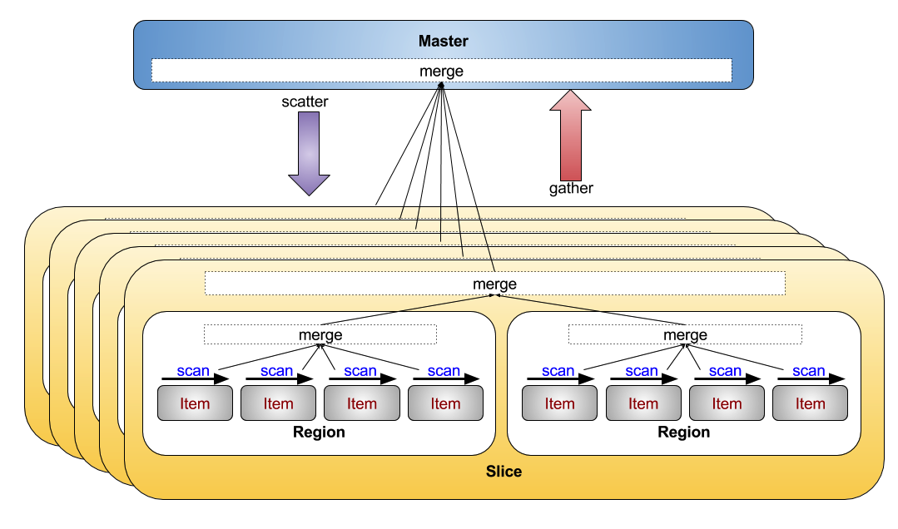

# Fabric Execution

## Fabric Distributed Processing Model

Fabric has a fairly simple processing model that supports the distribution of work and collection or results
over the distributed data model discussed above.

### Scatter/Gather
The only  distributed execution model supported is a basic scatter from the supervisor to worker, followed by
a gather from those workers back to the supervisor. No shuffles, sorts, or other sorts of multi-stage processing
is provided for. The basic model is:
1) Supervisor chooses a set of Worker instances based on knowledge of Worker status and data affinity.
1) Supervisor _scatters_ (serialize/message) the same __Scanner__ to all choosen Worker instances
1) Worker instances ensure appropriate data is loaded and perform parallel scans - one core per Region.
1) Worker instances merge scans across Item instances in a Region and across Regions within a Slice.
1) Worker instances send (serialize/message) merged results as a __Gather__ instance back to the Supervisor.
1) Supervisor merges results from all Slice/Worker instances

### Scan/Merge
___Waves___ are Burst's two stage scatter-gather distributed execution model.
__Stage 1__ is where a given supervisor propogates a  _'wave'_ of multiple
parallel distributed execution tasks defined for a given execution
to a carefully chosen set of worker nodes. __Stage 2__ is where the supervisor
gathers the _reflected_ result wave back from the workers, _merging_ the
results together, and delivering the final result
back to the waiting Burst client.

---
------ [HOME](../../../../../../../../../readme.md) --------------------------------------------
