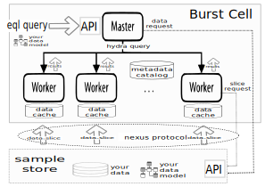

 

---
[`Why Burst`](whatwhyhow/burst_whatwhyhow.md) [`Get Started`](boot/burst_get_started.md) [`Use Cases`](usecase/burst_use_cases.md) [`Architecture`](architecture/burst_architecture.md) [`Documentation`](burst_documentation.md) [`Blog`](blog/burst_blog.md)

---

# `Uncompromising Behavioral Analysis`
Have valuable conversations with your behavioral data. Ask the 
questions that are hard to ask on other systems
and get clear and clean answers which lead to 
even better questions in a virtuous cycle. Scale cost effectively.
Available now as an _early-beta_ open-source release.

## What is Behavioral Analysis? 
`Behavioral Analysis` is the effort to understand
what `large` sets of `things` do over `time`.
Generally these things, which we called `entities`, represent or model
some singular conceptual or physical reality e.g.
personal compute device, medical patient, stock, vehicle, star-system,
student, criminal, process. These entities and some sort of record of their
behavior over time is stored in an appropriate data store and format
and the associated analysis scans through all these entities collecting
 intelligent conclusions about what one more
cohorts or the entire set did (or did not do) in some time frame. The 
results are one or more 
groups of measurements/counts much like a relational database.

## What is Burst?
Burst is a framework for building behavioral analysis systems. It is meant
to overcome some of the primal challenges associated with standing up
scalable real world Behavioral Analysis:
1. Generally there are a large number of entities involved
2. Generally these entities contain long and rich recordings of their 
  behavioral history
3. Generally much of the history is irrelevant `noise` with respect to the current
  exploration.
4. Generally the questions you want to ask are highly nuanced, often
 complex and having a
 well considered, intuitive,  carefully crafted method for asking them
 is a make or break proposition.
5. Generally its very important to get answers to your questions very quickly
 so as to nurture an organic intuitive question/answer cycle.

Burst is capable of getting fast answers to rich and nuanced questions posed
of large entity sets with significant noisy histories. It can scale
to any generally practical size of compute cluster with few limits. 
It has the proven capability to juggle large numbers of peak sessions in a real
world 24x7 cost-effective interactive service.

# What does it take to run Burst with my data?

### Burst Cell (master/worker linux cluster)
Burst is a linux server 'cell' or 'cluster'
with a familiar master/worker topology
running on your choice of
a process orchestration system such as Kubernetes.

### Metadata Catalog (rdbms)
Burst requires a RDBMS system available to store Burst specific metadata. Pretty much
any JDBC SQL provider will do as the metadata model access patterns are very simple
and performance requirements are small. MySql is supported out of the box, but it
is straightforward to provide a new 'dialect' e.g. Postgres or Oracle.

### Data Store
In order to load your data into the Burst Cell, you need to setup some sort
of Burst `Store`. Burst provides a library that supports the 
construction of custom data sources.
Though it is possible to build quite simple custom Store instances, Burst 
provides a framework for building  high-performance, flexible, distributed 
node data import subsystems
called `Sample-Stores`. We are working on open sourcing our internal HBASE
SampleStore that has been running for many years on enormous HBASE clusters 
with very high performance.

### Data Model
In order for the Burst systems to support  your particular data modeling choices, 
you will need to construct a Burst data model. A Burst data model consists of
three parts. 

#### Schema files
The first part is a high level `Motif` schema file which tells 
the high level language how to use your data model and query construction
time. The second part is a low level data model written as `Brio` schema file.
This tells the low level data management and the `Hydra` execution language
how to use your data. There are very similar data models allowing you
to define the types and relationships that you want to capture. 

#### Pressing
The third part of the data model is a custom 
binary encoder, implemented on top of the **Burst** `Pressing` library.
This code take your data as it is loaded from your datasource
and converts (presses) it to the internal **Burst** `Brio` data model
binary format. 

**NOTE:** You do not need to write a decoder. This is handled
by the generated code in the `Hydra` execution language.

### Analysis queries
Lastly you will need to write your own queries in the EQL high level
language. This can be done using **Burst**'s UI `Dashboard`. The Dash
provides simple metadata manipulation, query execution, results management,
and runtime monitoring of the progress and any associated status, warnings,
and error information.

# How hard is this?
Its time to be fully candid that Burst is not yet a full-featured,
throw it up in a weekend data analysis system. It is a  high performance
behavior analysis system designed to handle fast feeds, high loads, 
24x7 uptimes, and low latency. It was also carefully designed to 
demand  cost-efficient high utilization in its underlying distributed
linux server foundation. It was also
a requirement from the very start to be application flexible.
It is fully schema independent and has
carefully abstracted APIs and support libraries. Lastly it was always
carefully architected to be extended and modified.

However Burst does require significant skill to understand and use effectively
in a fully custom application.
We have released this
as open source in the hopes that it will be appreciated as such and that
perhaps a growing community can be part of moving this effort forward to 
achieve that level of easy adoption.
