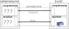
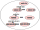

# `Burst Data Model`

--- 
###### _"Burst data is optimized at all levels; from the distributed node partitioning/slicing to the region based multicore parallelism and its byte order binary encoded as an object-tree depth-first-traversal"_

---
Burst is _**not**_ a database. It does _**not**_ store data 
authoritatively, though it does intelligently [cache](#data-cache) 
data locally in memory as well as on disk.
It imports (samples) data _on-demand_ 
via a [data loading pipeline](#data-loading-pipeline), 
from your external data source or feed,
via its built in [sample store](#sample-store) 
subsystem that is customized for your data via a
bespoke  [sample source](#sample-source) implementation 
that you write, or an existing one that you modify and/or configure
to meet your needs.  

## `data loading pipeline`

The exact topology/implementation of your
_on-demand_ data loading pipeline is highly dependent on the type of data
and the type of datasource or datastream you are pulling from. 
The **Burst** **samplestore** architecture and its specialized 
parallel data protocols
provides support for a wide range of systems
from a single SQL server database to an
HBASE installations with many hundreds of data nodes.

#### `author a schema for your entity tree`
In order for Burst to understand and process
your data, your entity data model needs to
be defined in a suitable  [Brio](../../burst-brio) 
Schema.  This schema needs to be available anywhere
your data is being used. This schema is written in a 
specialized source language
and placed as a resource into a schema/presser provider framework 
discoverable on both the samplesource and burst classpath.

#### `implement a 'presser' for your entity tree object model`
To go along with your schema, you need to implement a 
_Brio presser_ using Burst libraries. This presser, driven
by the schema, is a Burst library which efficiently
encodes _(low GC churn, multicore)_ generic entity trees,
in some external data model,
into the specialized internal Brio Blob binary format. This
internal form
is used all the way through the rest of the pipeline
including the network (as compressed), disk, and in-memory.

#### `code and deploy your bespoke samplestore samplesource`
Burst provides libraries that support the writing of schema
and pressers and making them available on your classpath. 
This provider framework supports dynamic loading of
schema and pressers placed into the classpath. The  rest of
the samplesource implementation is up to you. You need only
include a few Burst libraries.

#### `create and manage the metadata for your data`

When talking about Burst data one most start with the data about that data. In order
for Burst to load your data in order to analyze it, you must give Burst a minimum
of information so it can load and manage it.

**Burst** has a subsystem called the [Catalog](../../burst-catalog) 
that manages various salient metadata types using an external SQL database. 
The [Domain](#domain-metadata) and the  [View](#view-metadata) are the 
two managed metadata types
associated with the management of data.

#### `domain metadata`
**Domains** are a generalized specification for a dataset e.g. _a set of entities that
is all end users of a specific mobile application_. Burst uses need to create a 
Domain metadata object in the Catalog
for each _type_ of dataset they want to do behavioral analysis on.

#### `view metadata`
**Views** are a specification for a particular 'view' of a Domain
e.g. _the last 30 days of all european users of that mobile application_.
Burst uses need to create a View metadata object 
in the Domain for each specific dataset they want to 
do behavioral analysis on.

## `the sample store`

The samplestore

### `samplestore`
sdfg

### `samplesource`
sdfg

## `the generation`

#### `generations`
sdfg

#### `slice`
sdfg

#### `region`
sdfg

## `data cache`

#### `slice evict`
#### `slice flush`

#### `samplestore performance and resiliency expectations`
The speed and resiliency of data import in Burst is of course highly
dependent on the external data store. What can be said is that 

---
------ [HOME](../../readme.md) --------------------------------------------
